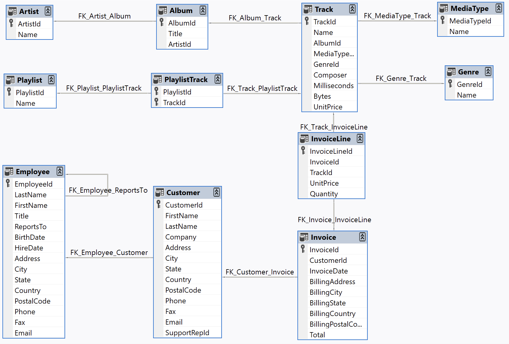

## 🎵 Chinook Digital Music Store - End-to-End SQL Data Analysis

## 🔗 Quick Links & Resources
* 📊 **Executive Presentation:** [View Full Presentation on Canva](https://canva.link/ovvgrz1o1yuszva)
* 💾 **Dataset Source:** [Download Chinook Database Here](https://github.com/lerocha/chinook-database) 
* 👨‍💻 **Project Type:** NTI Capstone Project

---

## 🗂️ Database Schema
The analysis is built on the Chinook Database, which simulates a digital music shop. Below is the Entity-Relationship Diagram (ERD) mapping our joins and business logic:

---

## 📌 Project Overview
This project is an end-to-end data analysis portfolio piece analyzing the **Chinook Digital Music Store** database. It was developed as the capstone project for the **NTI (National Telecommunication Institute) Data Analysis Track**. 

The goal of this project goes beyond writing SQL queries; it focuses on extracting actionable **Business Insights**, optimizing content strategy, and advising on marketing segmentation using robust statistical methods and advanced SQL logic.

---

## 🛠️ Phases & Key Business Insights

### 🧹 Phase 0: Data Cleaning & Structural Exploration
**Objective:** Establish data integrity and map the underlying business architecture before conducting financial analysis.
* **Data Quality Audit:** Engineered an unpivoted NULL-audit query, revealing a 99% completion rate in customer data, but identifying a ~28% gap in Track Composer metadata (handled via 'Anonymous' placeholders).
* **Pricing Anomalies (Robust Statistics):** Implemented a robust statistical outlier detection using **Interquartile Range (IQR)** to identify pricing anomalies, successfully distinguishing standard tracks ($0.99) from premium video content ($1.99).
* **Hierarchical Mapping:** Developed a `RECURSIVE CTE` to dynamically map the organizational chart, visualizing the exact chain of command.

### 💰 Phase 1: Sales Analysis (Revenue & Performance)
**Objective:** Evaluate the company's financial health, measure sales agent efficiency, and uncover purchasing patterns.
* **Basket Size vs. Premium:** Expanded on basic subqueries by combining `Invoice` and `InvoiceLine` to prove that high-value transactions are driven by transaction volume (Basket Size) rather than premium item sales.
* **Unit Economics (AOV):** Calculated Customer Average Order Value (AOV) to segment VIP clients.
* **Automated KPIs:** Engineered an automated `YOY_Growth` View utilizing `LAG()` and `CASE` statements to flag yearly revenue as 'Peak' or 'Warning'.

### 🌍 Phase 2: Customer Insight (Demographics & Behavior)
**Objective:** Segment the customer base, calculate Lifetime Value (LTV), and map geographic product-market fit.
* **Advanced Segmentation:** Utilized `AVG() OVER()` to dynamically calculate the global average spend, then used `LIMIT/OFFSET` pagination to separate the "Top 5 VIPs" from the "Upper-Middle" customer cohort.
* **Global Reach & ARPU:** Engineered an ARPU (Average Revenue Per User) metric to evaluate the true profitability of international markets outside the USA.
* **Geo-Musical Profiling:** Deployed a complex CTE combining `ROW_NUMBER()` and `GROUP_CONCAT()` to automatically generate a readable, string-aggregated list of the Top 3 spending countries for every music genre.

### 🎼 Phase 3: Product Intelligence & Catalog Strategy
**Objective:** Audit catalog health, evaluate product-market fit by content type, and identify actionable areas for inventory optimization.
* **Dead Stock Identification:** Used `COALESCE` to handle zero-revenue items and built a dynamic flagging system to identify "Dead Stock" (genres with >50 tracks but <20% sell-through rate).
* **Duration Strategy:** Implemented `CASE WHEN` statements to segment tracks by duration, discovering that consumers heavily favor tracks in the '4-6 minute' (long) range.
* **Upselling Potential:** Algorithmically classified album performance into 'High/Medium/Low' tiers based on mathematically derived completion rates, highlighting opportunities for "Complete My Album" discounts.

---

## 💡 Strategic Business Insights & Recommendations

Based on the end-to-end analysis of the Chinook database, we extracted the following actionable recommendations to optimize revenue, marketing, and catalog health:

### 💰 Phase 1: Sales & Revenue Strategy
* 🛒 **Basket Size vs. Premium:** High-value invoices are driven by bulk purchases (larger basket sizes), not premium-priced items. 
  * **Recommendation:** Push "Bundle Offers" (e.g., Buy 10 tracks, get 1 free) to naturally increase Average Order Value (AOV).
* 📉 **Financial Trajectory:** Automated YoY tracking revealed consistent mid-term growth, but flagged a decline in the final recorded year. 
  * **Recommendation:** Deploy "Win-Back" email campaigns offering targeted discounts to churned users before the fiscal year ends.
* 🏙️ **Urban Market Efficiency:** Cities like Prague matched others (e.g., São Paulo) in transaction volume but generated significantly higher revenue per order. 
  * **Recommendation:** Localize premium ad budgets to high-AOV (Average Order Value) cities rather than treating all urban markets equally.

### 🌍 Phase 2: Customer Demographics & Targeting
* 💎 **The "Upper-Middle" Cohort:** Beyond the top 5 VIPs, we isolated a secondary cohort of 20 customers who spend just above the global average. 
  * **Recommendation:** Launch aggressive cross-sell campaigns specifically for this cohort to graduate them into the VIP tier.
* 🚀 **International ARPU:** While the USA has the most users, calculating Average Revenue Per User (ARPU) revealed smaller international markets with much higher spending power per capita. 
  * **Recommendation:** Reallocate customer acquisition budgets towards these high-ARPU international countries to maximize ROI.
* 🎯 **Geo-Musical Mapping:** We algorithmically mapped the "Top 3 Spending Countries" for every single genre. 
  * **Recommendation:** Use this as a blueprint for hyper-targeted ad spend (e.g., automatically routing Latin Music promotions directly to the most profitable regions).

### 🎼 Phase 3: Product Intelligence & Catalog Strategy
* 📦 **Dead Stock Identification:** Certain genres have massive inventory (50+ tracks) but a sell-through rate of under 20%. 
  * **Recommendation:** Halt procurement budgets for these underperforming genres immediately. Liquidate current inactive tracks via discounted bundles.
* ⏱️ **Duration Strategy (The Sweet Spot):** Data segmentation proves that consumers heavily favor tracks in the '4-6 minute' (Long) range. 
  * **Recommendation:** Prominently feature 4-6 minute tracks on the storefront homepage and prioritize this duration in future catalog acquisitions.
* 💿 **Upselling Potential (Album Completion Gap):** Algorithmic classification of album performance highlights that many users buy single tracks rather than full albums. 
  * **Recommendation:** Implement a dynamic "Complete My Album" feature. If a user buys tracks from an album, offer them the remaining tracks at a dynamic discount.

---

## 💻 Tech Stack & Key SQL Concepts
* **RDBMS:** MySQL
* **Advanced Techniques:** Window Functions (`OVER`, `PARTITION BY`, `LAG`, `ROW_NUMBER`), Common Table Expressions (CTEs), Recursive CTEs, Data Bucketing (`NTILE`, `CASE WHEN`), String Aggregation (`GROUP_CONCAT`), Dynamic Views.
* **Data Visualization:** Canva Presentations (See `/Presentation` folder).

---

## 👥 Contributors & Acknowledgements
This project was a collaborative effort and successfully completed as part of the **NTI Data Analysis Track**. 

A special thanks to my project partner for the incredible teamwork. We worked closely together on writing complex SQL queries, optimizing data architecture, and extracting the final business insights.

* 👨‍💻 **[Samir Hendawy](https://github.com/SamirHendawy)**   - Data Analyst
* 👨‍💻 **[Eng. Abd El Rahman Sadek Kamel Sadek](https://github.com/AbdulrahmanSadik)**  - Data Analyst & Project Partner

Special thanks to the **NTI** instructors and mentors for their guidance throughout this track.
